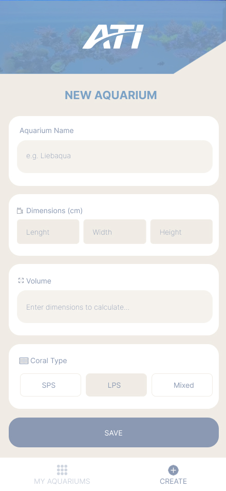
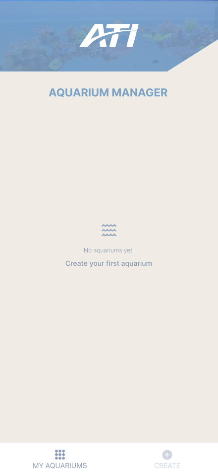
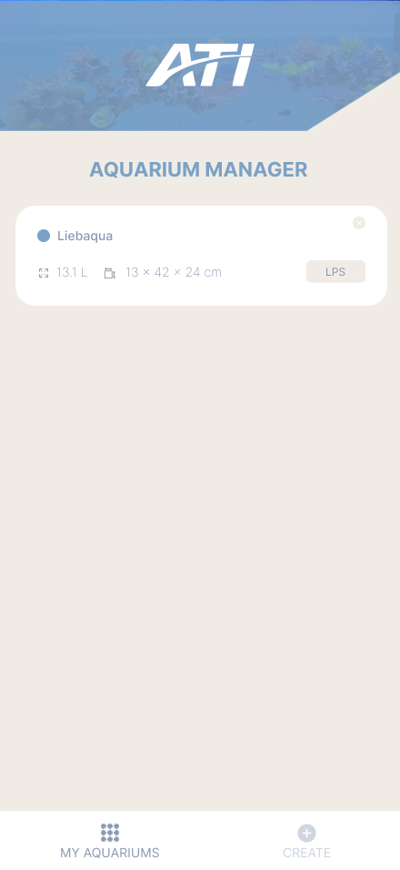

# Aquarium Manager 🐠

Eine Flutter-App zum Erstellen und Verwalten von Aquarien – gebaut als technische Aufgabe für **ATI Aquaristik**.

---

## So startest du die App

**Voraussetzungen:**
- Flutter SDK (3.2+)
- Chrome Browser (Oder Android Studio)

**Starten:**

```bash
git clone https://github.com/itsbmed/aquarium_manager_app.git
cd aquarium_manager_app
flutter pub get
flutter run -d chrome (oder Wenn du android Studio hast, einfach Flutter run)
```

Alternativ kann die App auch als APK auf einem Android-Gerät installiert werden. Die APK-Datei befindet sich im `build/` Ordner.

---

## Was kann die App?

- Name für das Aquarium eingeben
- Maße eingeben (Länge, Breite, Höhe in cm)
- Volumen wird automatisch in Liter berechnet
- Korallentyp auswählen (SPS, LPS, Mixed)
- Eingabevalidierung (keine negativen Werte, keine leeren Felder)
- Mehrere Aquarien in einer Liste anzeigen (ohne Persistenz)

---

## Projektstruktur

```
lib/
├── main.dart              # Einstiegspunkt + Navigation
├── app_colors.dart        # Farbpalette der App
└── screens/
    ├── aquarium_form.dart  # Formular zum Erstellen
    └── aquarium_list.dart  # Listenansicht
```

---

## Architektur

Die App ist einfach und übersichtlich aufgebaut:

- **main.dart** verwaltet die Tab-Navigation und die Aquarienliste im Speicher
- **aquarium_form.dart** enthält das Formular mit Validierung und Volumenberechnung
- **aquarium_list.dart** zeigt die erstellten Aquarien als Karten an

Das Volumen wird bei jeder Eingabe in Echtzeit berechnet mit der Formel:
**(Länge × Breite × Höhe) / 1000 = Liter**

Die Aquarien werden im State von HomeScreen gespeichert und über Callbacks zwischen den Screens weitergegeben.

---

## Entscheidungen

- **Flutter** gewählt, weil es in der Stellenausschreibung erwähnt wurde und eine Codebasis für iOS + Android + Web ermöglicht
- **Einfache Struktur** – kein Over-Engineering, der Code soll lesbar und nachvollziehbar sein
- **Eigenes Design** – UI inspiriert von ATI Aquaristik mit hellen, warmen Farben
- **Keine externe Pakete** für die Kernfunktionalität – nur Flutter-Bordmittel

----

## Wireframe

```
┌──────────────────────────────┐
│       Create Aquarium        │
├──────────────────────────────┤
│ Name                         │
│ ┌──────────────────────────┐ │
│ │ My Reef Tank             │ │
│ └──────────────────────────┘ │
│                              │
│ Dimensions (cm)              │
│ ┌─────────┐ ┌─────────┐ ┌─────────┐
│ │ Length  │ │ Width   │ │ Height  │
│ │  100    │ │   50    │ │   60    │
│ └─────────┘ └─────────┘ └─────────┘
│                              │
│ Volume (Liters)              │
│ ┌──────────────────────────┐ │
│ │ 300 L (auto-calculated)  │ │
│ └──────────────────────────┘ │
│                              │
│ Coral Type                   │
│ ┌──────────────────────────┐ │
│ │ (•) SPS                  │ │
│ │ ( ) LPS                  │ │
│ │ ( ) Mixed                │ │
│ └──────────────────────────┘ │
│                              │
│ ┌──────────────────────────┐ │
│ │          Save            │ │
│ └──────────────────────────┘ │
└──────────────────────────────┘
```

----
## Design

👉 [Figma Design ansehen](https://www.figma.com/design/KgH8SgYCe5a6xvGQNwkp1J/ATI-Aquarium-Manager?node-id=0-1&t=j4NHx3SA3jrvbC5D-1)
---

### App Screenshots








